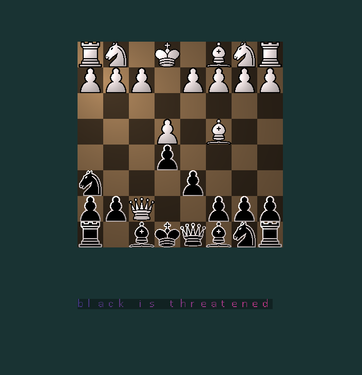

# OpenGL Chess

Thou who read this message, gather thy spirits and read my horrid code!  

At the start of this project I had never written C++ in my life!  
This was a great learning experience, and I appreciate the colaboration wiht @HannibalBarkas.  
However, given this neither the code nor the structure is in any way shape or form consisten or clean.  
Be prepared!  

#### OpenGl note
Most of the opengl code builds heavily on https://learnopengl.com/Getting-started/OpenGL  
Basic opengl knowledge is required, however, this does not go beyond basic  

#### Horrid Markdown
I have now for the first time looked at markdown. It shows. For your eyes I pray, oh reader. 

## Project Structure

main.cpp --- runs the program.   
src/* --- source code.   
|   glBoilerplateAndHelpers/* --- OpenGl boilerplate, load textures, create sprites.   
||   sprite.* --- sprite class and really stupid "as-float" encoder that breaks on big endian systems. at least i think it does.  
||   texture.* --- texture loader for opengl.  
|   shaders/* --- GLSL shaders. everything is done in NDC and screenspace.  
||   highlight.* shader for creating highlights under selected fields.  
||   sprite.* --- same for sprites  
||   text.* --- same for text  
||   ui.* --- missing feature. did not have time to clean the entire codebase.  
||   calibri.c --- texture map for text created with piskel. Thanks to @Sivecano, he created the text system in an earlier project with me  
||   chess.* --- chess backend. ALMOST stateless. but sorta messy. I guess its pretty efficient though... only thing it is  
||   chessSpriteHandler.* --- uhhh... a really dumb way of rendering a chessboard. As everything here, totally under and over built at the same time.  
||   eventSystem.* --- An event system taken from a project with @Sivecano. It's use here is totally unnecessary. Writing it was my introduction to function pointers, i thought it was cool, that is why its here.  
||   glad.c -- OpenGl bindings generated with https://glad.dav1d.de/  
||   helpers.* --- a lot of code in here has been taken from my previous endeavour with @Sivecano. mostly random utils  
||   input.* --- input system. this one is particularly horrid and sphagetti.  
||   move.* --- oh god. the game handler. Any skill in coding I had, broke down here.  
include/* --- cmake include files  
lib/* --- external libraries  
chess-sprites/* --- sprites  

## Ah yes how this is actually played. If it does not break on cloning...

 
 
click on figure. press e to select figure. click field to move to. press e to move. all other instructions will be presented on screen.

## git repo notes...

uhh beware the detached heads, submodules and other horrible stuff. might also not be fully windows compatible, despite @Sivecanos testing on that.  
~~no one needs windows anyway ew what a gross OS~~

## build n stuff
might create a release  
else build with cmake, was coded in clion, should work on Code OSS and microsofts version of it.

## contributors
Me -- KalokaK, graphics, chess backend, input  
My collaborator on this project -- HannibalBarkas, original backend  
My friend and windows tester -- Sivecano, minor windows fixes, texture loader, text system  
